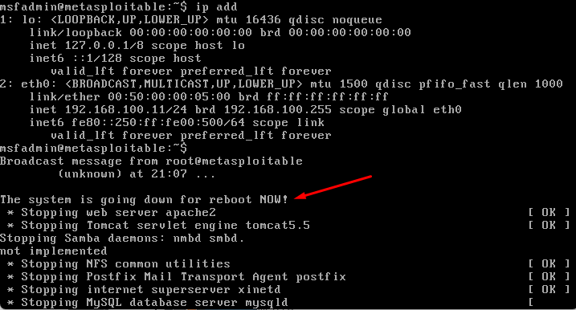

Hoje iniciaremos um laboratório para mostrar como é possível obter acesso não autorizado a uma máquina utilizando uma vulnerabilidade chamada Backdoor.

Vamos utilizar essa arquitetura de inicio para realizarmos o nosso LAB.

**O que é um backdoor?**
É uma falha interna que permite que um invasor obtenha acesso não autorizado.

---

Em julho de 2011, uma comunidade de segurança descobriu que um atacante tinha inserido um backdoor no código da versão 2.3.4 do vsftpd, um servidor FTP de código aberto para Unix. Esse incidente ilustra um dos motivos pelos quais é perigoso utilizar ferramentas de código aberto.

Mas vamos ao que interessa. Vamos executar comandos para obter acesso a uma máquina vulnerável que usamos para este laboratório, chamada Metasploitable. Tudo o que precisamos fazer é fazer login no servidor FTP dessa máquina usando o nome de usuário `:)` e a senha `invalid`. Uma vez que conseguimos estabelecer a conexão, ele abre um `shell` na porta 6200. O `shell` é um programa que conecta a máquina do atacante para executar comandos em máquinas comprometidas.

1. Vamos utilizar o comando `netdiscover` para descobrir o IP do Metasploitable que está na mesma rede da máquina do hacker.

Conseguimos identificar a máquina.

2. Utilizando o Backdoor para Obter Acesso

Vamos usar o comando Netcat `nc`, que é uma ferramenta de linha de comando que suporta diversas funções de rede.

Abra o terminal no Kali e insira o comando abaixo:

Normalmente, se não alterado, o FTP Server roda na porta 21. Agora que você ativou o shell associado ao backdoor, abra um novo terminal e insira o seguinte comando:

Pode parecer que você não tem conectividade, mas tente inserir o comando `ls` e, mais ainda, insira o comando para dar um reboot na máquina, como no exemplo acima. Como pode ver, a máquina reiniciou.

Este é apenas um exemplo do que pode ser feito. Imagine o que mais é possível. Para corrigir essa vulnerabilidade, é necessário atualizar a versão do vsftpd, pois essa vulnerabilidade foi removida.

Espero que tenha gostado dessa introdução. Há muito mais por vir.