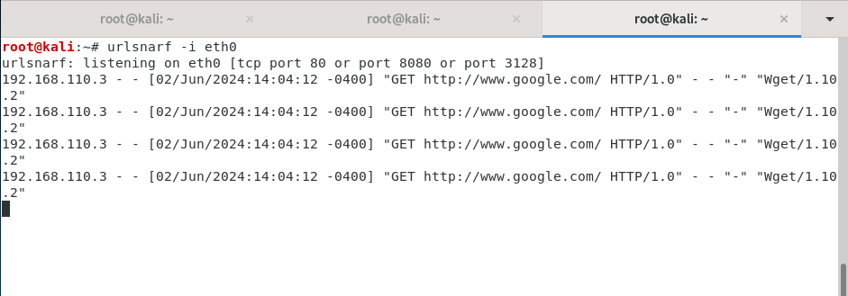

# ARP Spoofing

Qualquer pessoa que esteja em uma rede, por exemplo, um Wi-Fi de uma cafeteria, poderia interceptar e ver outros tráfegos web não criptografados usando a técnica "ARP Spoofing", que explora uma vulnerabilidade do design ARP.

## Introdução

Vamos aprender primeiro como a Internet transmite dados usando pacotes, endereços MAC e endereços IP.

### Pacotes

Toda informação na Internet é transmitida em pacotes. Um pacote pode conter os dados que você deseja enviar. Pense nisso como um serviço postal: no serviço postal, você coloca o endereço de origem e destino, transformando isso em pacotes de dados.

### Endereço MAC

Cada PC possui uma interface de rede que permite conectar-se a um roteador Wi-Fi. Esta placa possui um endereço único, chamado MAC. Quando um roteador quer enviar informações para seu PC, ele rotula o pacote com seu MAC e, então, transmite como um sinal de rádio, verificando se o MAC do pacote é destinado a ele. O endereço MAC é composto por 48 bits em hexadecimal.

### Endereço IP

O endereço IP define sua localização geográfica. Por exemplo, se você muda de cafeteria, seu IP muda, mas seu MAC permanece o mesmo. O IP consiste em 4 seções, cada uma representada por 8 bits.

### Tabelas ARP

Como um roteador em uma rede LAN, também conhecida como rede de baixo nível, sabe o MAC de um determinado IP? É aqui que entra o ARP. O roteador envia uma mensagem para todas as máquinas da rede chamada "ARP query". A máquina com o IP correspondente responde com um "ARP response" contendo seu MAC. Assim, o roteador armazena isso em sua tabela de roteamento, evitando a necessidade de emitir uma consulta ARP toda vez.

- **Endereço MAC**: Quem é você
- **Endereço IP**: Onde você está
- **Tabela ARP**: Gerencia o mapa entre quem você é e onde você está.

## Ataque de ARP Spoofing

O ataque de ARP Spoofing consiste em duas fases:

1. O invasor envia uma resposta ARP falsa para a vítima, afirmando que o MAC do invasor mapeia o endereço IP do roteador. Isso permite que o invasor engane a vítima, fazendo-a acreditar que a máquina do invasor é o roteador.
2. A vítima reconhece o pacote ARP falso enviado pelo invasor, atualizando sua tabela ARP para refletir que o MAC do invasor agora mapeia o IP do roteador. Isso significa que todo o tráfego web da vítima será encaminhado para o invasor, que então inspeciona e encaminha o tráfego para o roteador.

Se o invasor quiser interceptar o tráfego vindo da Internet, será preciso também enganar o roteador, criando um pacote ARP falso indicando que o IP da vítima mapeia para o MAC do invasor. Um ataque de ARP Spoofing é um exemplo de ataque man-in-the-middle, porque o invasor se coloca entre a vítima e o roteador.

## LAB (ARP Spoofing)

Vamos usar a ferramenta `dsniff` no Kali Linux, que contém várias ferramentas úteis para interceptar tráfego de rede, como o `arpspoof`.

### Instalando o dsniff


### Descobrindo Endereços IP

Primeiro, precisamos descobrir o endereço IP de outras máquinas na rede para falsificá-los. Usamos a ferramenta `netdiscover`.

```shell
sudo netdiscover
```


Essa ferramenta escaneia a rede, usando consultas ARP. Isso emite para todas as máquinas na rede e exibe os endereços MAC e IP.

### Ativando o IP Forwarding

Precisamos permitir que o Kali Linux encaminhe pacotes em nome da máquina da vítima. Ativamos o encaminhamento de IP:

```shell
echo 1 > /proc/sys/net/ipv4/ip_forward
```


### Executando o ARP Spoofing

Podemos gerar várias respostas ARP falsas com o comando:

```shell
arpspoof -i eth0 -t [IP da Vítima] [IP do Roteador]
```


- `-t`: especifica o alvo
- `-i`: representa a interface

Podemos executar o mesmo comando, porém invertendo-o para direcionar o tráfego proveniente da internet.


### Interceptando o Tráfego da Vítima

Vamos interceptar os pacotes da vítima com o comando:

```shell
urlsnarf -i eth0
```



Isso listará todos os sites que a vítima visitou.

Se rodarmos o comando `wget http://google.com` na máquina da vítima (metasploitable), podemos ver informações de todo o conteúdo que a vítima está acessando devido à falta de HTTPS, permitindo-nos visualizar tudo.

### Prevenção

Para evitar que a vítima desconfie do crime, por exemplo, se o invasor deixar a cafeteria, a internet da vítima será interrompida. Para evitar isso, use `CTRL + C` no `arpspoof`, que já faz o trabalho para nós.

### Detectando um Ataque de ARP Spoofing

Vamos criar um script em Python para detectar um ataque de spoofing. Construiremos nossa própria tabela ARP usando um dicionário para verificar se houve alguma alteração nos pacotes recebidos. Usaremos a biblioteca `scapy` para interceptar e analisar os pacotes que passam pela nossa NIC.

### Instalando o Scapy

```shell
pip3 install scapy
```

### Script de Detecção

```python
from scapy.all import sniff

IP_MAC_Map = {}

def processPacket(packet):
    if packet.haslayer('ARP') and packet.haslayer('Ether'):
        src_IP = packet['ARP'].psrc
        src_MAC = packet['Ether'].src
        if src_MAC in IP_MAC_Map:
            if IP_MAC_Map[src_MAC] != src_IP:
                old_IP = IP_MAC_Map[src_MAC]
                message = (
                    "\n Possible ARP attack detected \n"
                    + "It is possible that the machine with IP address \n"
                    + str(old_IP) + " is pretending to be " + str(src_IP)
                    + "\n "
                )
                return message
        else:
            IP_MAC_Map[src_MAC] = src_IP

sniff(count=0, filter="arp", store=0, prn=processPacket)
```

Executamos o script:

```shell
sudo python3 arpDetector.py
```

Com o programa rodando, abra outro terminal no Kali e execute um ataque de ARP spoofing. Quando seu programa Python detectar esses pacotes, você receberá uma mensagem como esta:


Essa mensagem indica que o IP da vítima está associado ao MAC do invasor.
